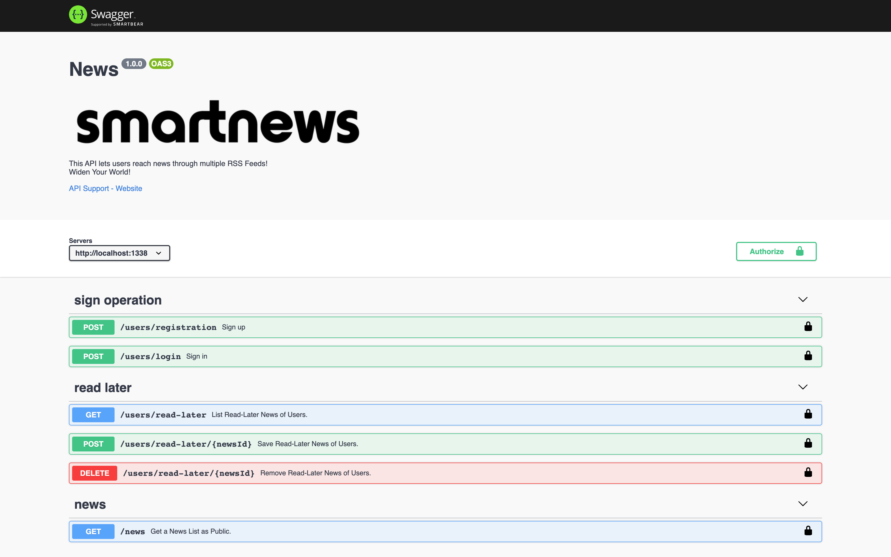

# Smart News! 
Get News Over All World!

Smart-News, The REST API application is completely written in Node.js
# Overview
* Get the latest news from different qualified sources like Yahoo, NY-Times.
* This API can work a user-based system.
* Users can register/login system as password/username.
* After logged, users can 
    * Save read-later news, 
    * Get read-later news,
    * Remove read-later news,
* PS: The system supports that users can not see same news that user has already seen.
--------
* REST API is developed using Express.js,
* Redis as Cache DB and Mongo as Persistent DB 
* Schedule with Kue.js for saving cache and persistent DB,
* Cache system support different TTL times according to sources.

# Installation

```
git clone https://github.com/xhkocatepe/smart-news.git
nvm use 12 
npm install
npm run start

open swager document file url
http://localhost:1338/swaggers/api-docs

.env file

MONGO_DB
CRON_EXPR_FOR_LATEST_UPDATE_NEWS
YAHOO_RSS_URL
NY_TIMES_RSS_URL
JWT_SECRET

For .env file detail please contact to me.
bayramhakankocatepe@gmail.com
```


